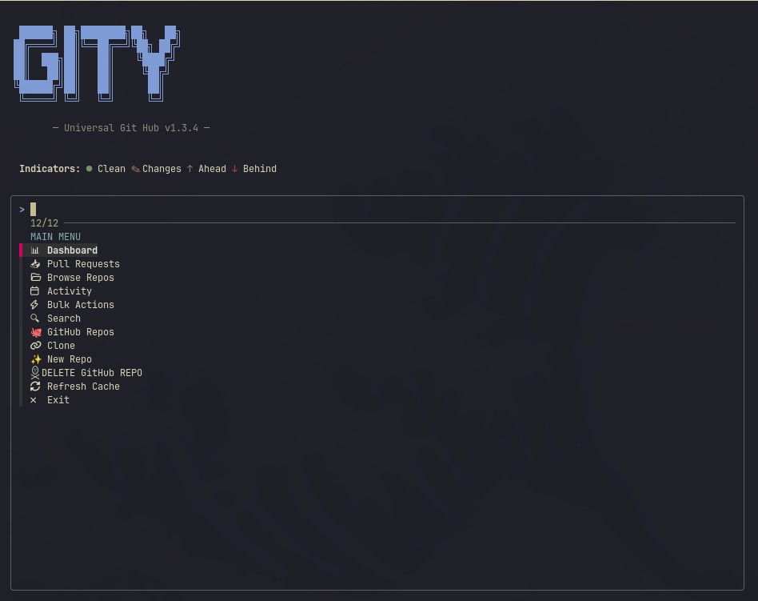

# Gity

**A powerful, keyboard-driven TUI hub for managing all your Git repositories in one place.**

No more hunting for repos across your filesystem. Gity automatically discovers all your Git repositories and brings them together with beautiful visualizations, status indicators, cross-repo search, bulk actions, and GitHub integration.

**Available for Linux, macOS, and Windows**



## Quick Install

| Platform | Command |
|----------|---------|
| **Linux** | `curl -sSL https://raw.githubusercontent.com/ehtishamnaveed/Gity/master/install.sh \| bash` |
| **macOS** | `curl -sSL https://raw.githubusercontent.com/ehtishamnaveed/Gity/master/install.sh \| bash` |
| **Windows** | `irm https://raw.githubusercontent.com/ehtishamnaveed/Gity/master/install.ps1 \| iex` |

That's it. One command per platform. Everything installs automatically.

---

## Features

### Visualization Dashboard
- **📊 Repos Needing Attention** — See at a glance which repos need work, color-coded by severity

### Core Features
- **Auto-Discovery** — Scans your home directory and finds all Git repos automatically
- **Repo Status Overview** — See which repos have changes, need pushing, or need pulling
- **Fuzzy Search** — Instantly filter through hundreds of repos with fzf
- **Bulk Actions** — Pull, push, commit, or run custom commands on multiple repos at once
- **GitHub Integration** — Browse and clone repos from your GitHub account (with organization support)
- **🔀 Merge Branches** — Merge branches in any repo with preview and confirmation
- **Recent First** — Your most-used repos always appear at the top
- **Clone & Create** — Clone new repos or create new ones from the app
- **Quick Actions** — Open in Lazygit, your default editor, or your file manager
- **Auto-Update** — Get notified of new versions and update with one click
- **Zero Config** — Works out of the box

## Requirements

Gity handles all dependencies automatically. Just run the installer and it installs everything you need.

### What Gets Installed

| Tool | Purpose | Linux | macOS | Windows |
|------|---------|-------|-------|---------|
| **git** | Version control | apt/pacman/dnf | brew | winget |
| **fzf** | Fuzzy finder | apt/pacman/dnf | brew | GitHub API |
| **lazygit** | Terminal UI for Git | apt/pacman/dnf | brew | GitHub API |
| **gh** | GitHub CLI (optional) | apt/pacman/dnf | brew | GitHub API |

## Installation

### Linux

```bash
curl -sSL https://raw.githubusercontent.com/ehtishamnaveed/Gity/master/install.sh | bash
```

The installer auto-detects your distro and installs dependencies. Supported: Arch Linux, Ubuntu/Debian, Fedora, OpenSUSE, Void Linux, and more.

After installation, make sure `~/.local/bin` is in your PATH.

### macOS

```bash
curl -sSL https://raw.githubusercontent.com/ehtishamnaveed/Gity/master/install.sh | bash
```

Make sure [Homebrew](https://brew.sh) is installed first. The installer uses Homebrew to install all dependencies (git, fzf, lazygit, gh CLI).

### Windows

Open **PowerShell** (or Windows Terminal) and run:

```powershell
irm https://raw.githubusercontent.com/ehtishamnaveed/Gity/master/install.ps1 | iex
```

The installer will:
1. Set PowerShell execution policy to `RemoteSigned`
2. Install **Git** via winget (`winget install --id Git.Git`)
3. Install **fzf**, **lazygit**, and **gh CLI** from GitHub releases
4. Download Gity to `%LOCALAPPDATA%\Programs\Gity`
5. Create a `gity.cmd` wrapper for easy access
6. Add to your PATH

After installation, open a **new** terminal (CMD, PowerShell, or Git Bash) and run:

```cmd
gity
```

> **Note:** Gity runs via Git Bash on Windows, which means it can access your Windows folders natively (`C:\Users\...`).

### Manual Install

```bash
# Linux / macOS
curl -sL https://raw.githubusercontent.com/ehtishamnaveed/Gity/master/gity.sh -o ~/.local/bin/gity
chmod +x ~/.local/bin/gity
```

```powershell
# Windows
irm https://raw.githubusercontent.com/ehtishamnaveed/Gity/master/gity.sh -OutFile "$env:LOCALAPPDATA\Programs\Gity\gity.sh"
```

## Usage

Run Gity from your terminal:

```bash
# Linux / macOS
gity

# Windows (CMD, PowerShell, or Git Bash)
gity
```

### Main Menu

| Option | Description |
|---|---|
| **📊 Dashboard** | Visual dashboard showing repos needing attention |
| **📂 Browse All Repositories** | Search and open an existing repo (with status indicators) |
| **⚡ Bulk Actions** | Perform actions on multiple repos at once |
| **🐙 GitHub Repos** | Browse and clone from your GitHub account (with org support) |
| **🔄 Refresh Cache** | Rescan for repositories |
| **↻ Update Gity** | Check and install updates |
| **❌ Exit** | Quit Gity |

### Status Indicators

| Indicator | Meaning |
|---|---|
| `●` (green) | Clean — no uncommitted changes |
| `✎` (yellow) | Has uncommitted changes |
| `↑` (cyan) | Ahead of remote — commits to push |
| `↓` (red) | Behind remote — commits to pull |
| `↕` (magenta) | Diverged — both ahead and behind |

### Dashboard View

The dashboard shows repos categorized by urgency:
- **🔴 NEED ATTENTION** — Repos with uncommitted changes or diverged from remote
- **🟡 NEED SYNC** — Repos that are ahead or behind
- **🟢 ALL SYNCED** — Repos that are fully synced

### Bulk Actions

When you select **Bulk Actions**, you can:
- **Pull All** — Run `git pull` on each selected repo
- **Push All** — Run `git push` on each selected repo
- **Status All** — View git status of all selected repos
- **Commit All** — Add all changes and commit with a single message

### GitHub Integration

When you select **GitHub Repos**:
1. Choose your user account or an organization
2. Browse repositories within that account/org
3. **Clone** — Clone to your local machine
4. **Open in Browser** — Open in your default browser

Requires `gh` CLI to be installed and authenticated. If not authenticated, Gity will prompt you to connect.

### Repository Actions

After selecting a repo, you can:

| Action | Description |
|---|---|
| **Open in Lazygit (TUI)** | Launch lazygit in that repository |
| **Browse Files (fzf)** | Browse all repo files with fuzzy search and preview |
| **Open in Default Editor** | Open repo using your `$EDITOR`, or your system's default |
| **Open in File Manager** | Open repo folder in your file browser |
| **Copy Path to Clipboard** | Copy the repo path to your clipboard |

### Keyboard Navigation

- Use **arrow keys** or **vim-style (j/k)** to navigate
- Press **Enter** to select
- Press **Escape** or select empty to go back
- Type to **fuzzy search** filter the list
- **Tab** to multi-select in Bulk Actions

## Auto-Update

Gity checks for updates on each run. If a new version is available:

1. A notification banner appears in the main menu
2. Select **Update Gity** from the menu
3. The latest version downloads automatically
4. Restart Gity to use the new version

## How It Works

1. **First Run** — Gity scans your home directory for `.git` folders and builds a cache
2. **Status Checking** — Shows real-time git status indicators for each repo
3. **Visualizations** — Beautiful dashboards for attention and activity
4. **Caching** — Repo list is stored for fast access
5. **Recent Repos** — Your last 10 opened repos are tracked
6. **Smart Scanning** — Deep scan common directories plus broad home scan

## Configuration

Gity works with zero configuration, but you can customize:

### Linux / macOS (`gity.sh`)

| Variable | Default | Description |
|---|---|---|
| `REPO_DIR` | `~/Documents/Github` | Where cloned repos are saved |
| `CACHE_FILE` | `~/.cache/lazygit_repos` | Repo discovery cache |
| `RECENT_FILE` | `~/.cache/lazygit_recent` | Recently opened repos |

### Windows

| Variable | Default | Description |
|---|---|---|
| `REPO_DIR` | `~/Documents/Github` | Where cloned repos are saved |
| `CACHE_FILE` | `~/.cache/lazygit_repos` | Repo discovery cache |
| `RECENT_FILE` | `~/.cache/lazygit_recent` | Recently opened repos |

> **Note:** On Windows, paths are relative to your Git Bash home directory (usually `C:\Users\YourName`).

## Uninstall

### Linux / macOS

```bash
rm ~/.local/bin/gity
rm ~/.cache/lazygit_repos
rm ~/.cache/lazygit_recent
```

Remove the PATH line from your `~/.bashrc` or `~/.zshrc` if added by the installer.

### Windows

```powershell
Remove-Item "$env:LOCALAPPDATA\Programs\Gity" -Recurse -Force
Remove-Item "$env:APPDATA\gity" -Recurse -Force
```

Remove Gity from your PATH in Environment Variables if needed.

## Contributing

Contributions are welcome! Feel free to open issues or submit pull requests.

## License

MIT License — see [LICENSE](LICENSE) for details.

## Acknowledgments

- [lazygit](https://github.com/jesseduffield/lazygit) by Jesse Duffield
- [fzf](https://github.com/junegunn/fzf) by Junegunn Choi
